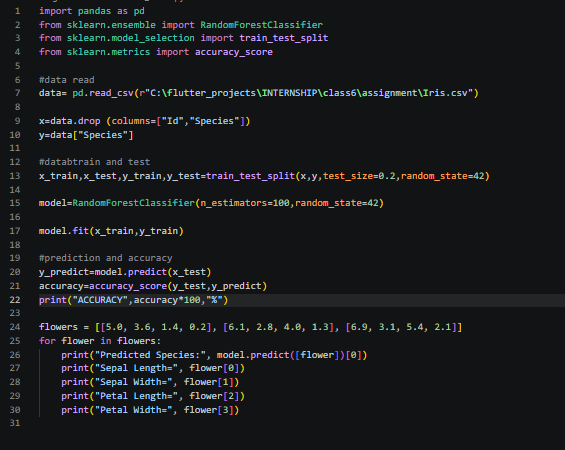
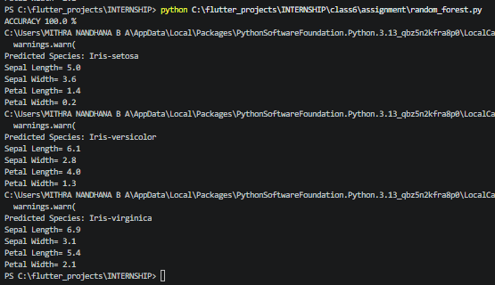

# Assignment8-Random-Forest
Assignment 8 about Random Forest by Mithra Nandhana BA

## Problem Statement
Write a Python program using scikit-learn to build an automated classification pipeline.

## Answer
The code is saved in the `assignment8-Random-Forest/assignment/` along with the csv file containing the data.

The code and the output  are given below.

## *Code*

## *Output*

## Final Answer
ACCURACY 100.0 %

Predicted Species: Iris-setosa
Sepal Length= 5.0
Sepal Width= 3.6
Petal Length= 1.4
Petal Width= 0.2

Predicted Species: Iris-versicolor
Sepal Length= 6.1
Sepal Width= 2.8
Petal Length= 4.0
Petal Width= 1.3

Predicted Species: Iris-virginica
Sepal Length= 6.9
Sepal Width= 3.1
Petal Length= 5.4
Petal Width= 2.1

# What I Learned
By this assignment and class, I learned:
1. Random Forest
2. drop function
3. testing and training

:D
